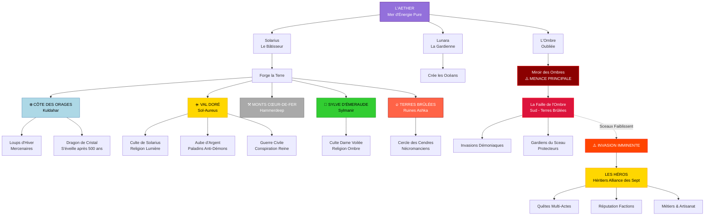
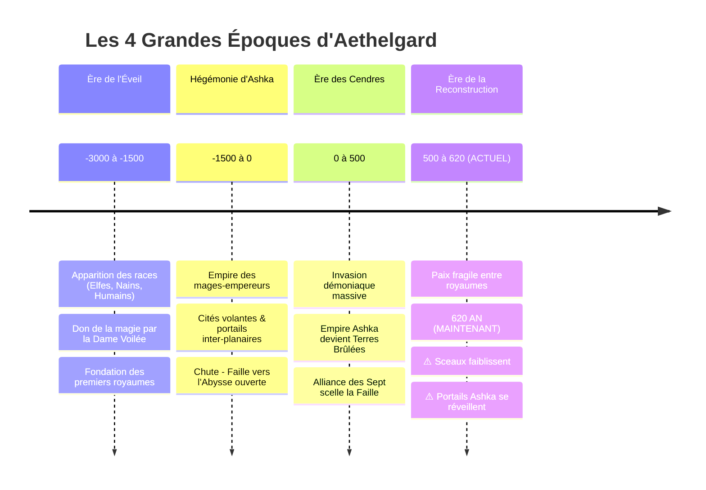
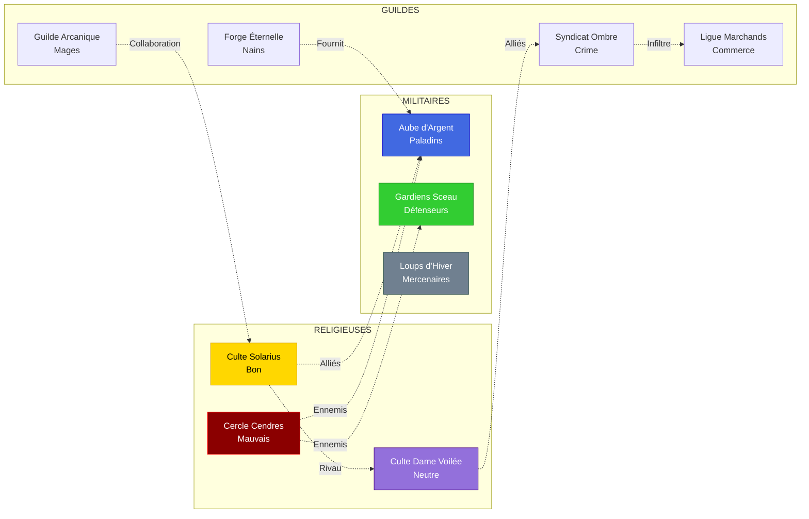
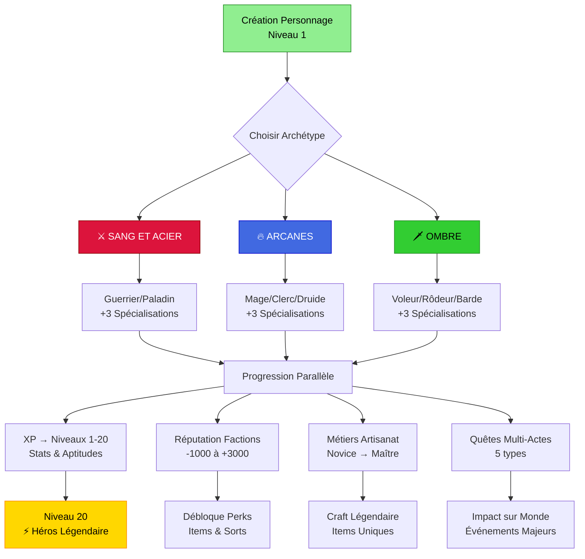
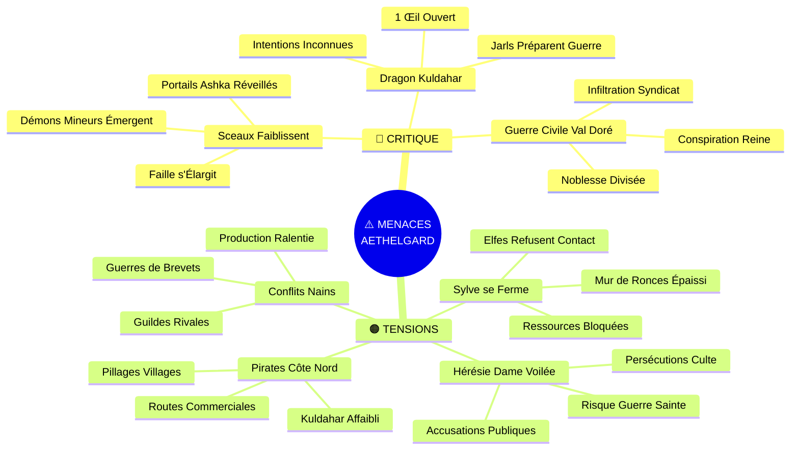
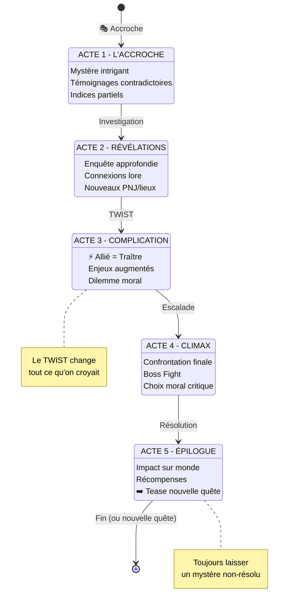
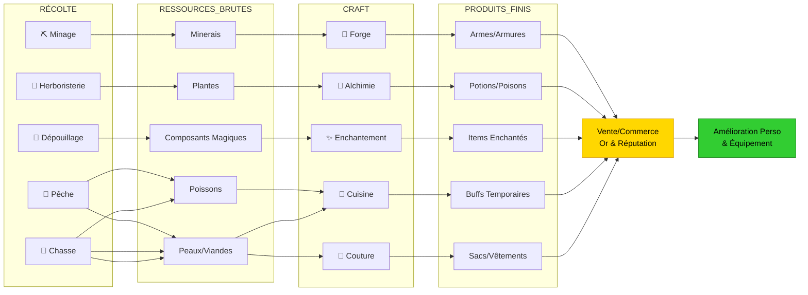
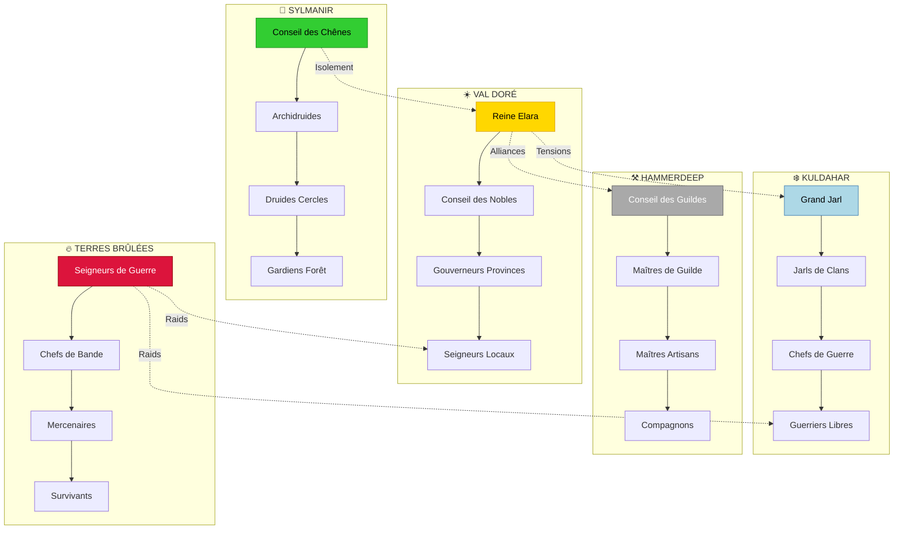

# 🗺️ DIAGRAMME RELATIONNEL - AETHELGARD

## Carte Visuelle du Monde (Mermaid)

---

## Chronologie Historique

---

## Architecture des Factions

---

## Système de Progression des Héros

---

## Carte des Menaces Actuelles

---

## Flow de Quête Type (5 Actes)

---

## Économie des Ressources

---

## Pyramide de Pouvoir Politique

---

## Légende des Symboles

| Symbole | Signification |
|---------|---------------|
| ⚠️ | Menace/Danger imminent |
| 🔴 | Critique/Urgent |
| 🟠 | Tension/Préoccupant |
| 🟢 | Stable/Sécurisé |
| ⚔️ | Combat/Militaire |
| 🔥 | Magie/Arcanes |
| 🗡️ | Ruse/Agilité |
| ❄️ | Nord/Glace |
| ☀️ | Centre/Lumière |
| ⚒️ | Est/Forge |
| 🌳 | Ouest/Nature |
| 🔥 | Sud/Destruction |
| ➡️ | Progression/Suite |
| ⚡ | Événement majeur |

---

**Créé le:** 2026-02-12  
**Version:** 1.0 - Diagrammes Relationnels Complets
